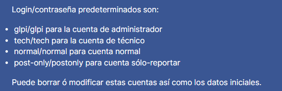

# Instalacion de glpi en local a traves de Docker

Utilizar el docker-compose.yml el cual levanta todos los servicios necesarios para ejecutar glpi de forma local

docker-compose up -d

# GLPI conf. inicial

Réplicas SQL (MariaDB o MySQL): db

Usuario SQL: glpi_user

Password SQL: glpi_password

Luego elegir la base de datos existente: glpi

Usuario: glpi

Contraseña: glpi

# Estructura de carpetas

- /tests: Legacy code, que almacena versiones o funcionalidad anteriores
- /image: imagenes varias
- /others: Archivos auxiliares
- root/:
  - app.py: ejecuta el codigo principal
  - .env.example: se utilizan variables de entornos para realizar el procedimiento, y este es un ejemplo de que se debe llenar
  - docker-compose.yml: Levanta todos los servicios necesarios para poder utilizar GLPI de forma local
  - Excel-tests.xlsx: Archivo excel que contiene la estructura escencial de los qr's
